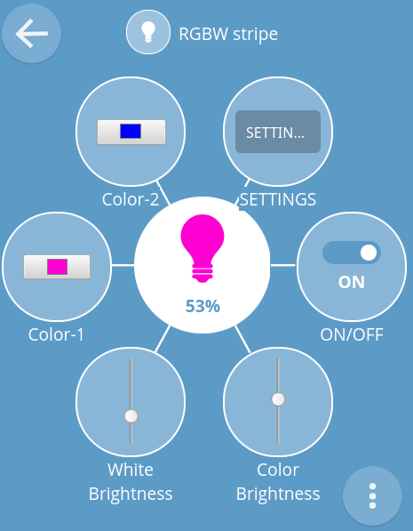
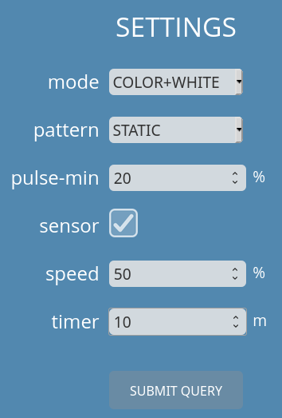

# webThing LED RGBW (RGB+White) controller

7th April 2020

## Introduction

This WebThing controller is prepared for ESP32 CPUs and uses esp-idf environment (current stable version).

The WebThing controls RGBW LED strip.

## Dependencies

Requires:

 * [web-thing-server](https://github.com/KrzysztofZurek1973/webthings-components/tree/master/web_thing_server) from ```webthings-components```

## Example

See [webthings-node-example-project](https://github.com/KrzysztofZurek1973/webthings-node-example-project) or [webthings-empty-project](https://github.com/KrzysztofZurek1973/webthings-empty-project).

## Features



WebThing has the following properties and one action with multi inputs:

 * ON/OFF
 * Color brightness, RGB channels, 0 .. 100%
 * White brightness, white channel, 0 .. 100%
 * Color-1, used by some patterns
 * Color-2, used by some patterns
 * Settings (action), with the following inputs
 	- mode: WHITE+COLOR, COLOR, WHITE
 	- pattern, color changing patterns
 	- pulse-min, used by "pulse" patterns
 	- sensor, if motion sensor is installed, check this option to switch ON LEDs after a sensor signal
 	- speed, the speed of color change in patterns other than "STATIC"
 	- timer, turn OFF after a specified number of minutes
 
 

## Documentation

See [webthings-empty-project](https://github.com/KrzysztofZurek1973/webthings-empty-project) and follow steps described in **Build webThing Device** chapter.

In point 5 download ```webthing-rgbw``` repository. In function ```init_things()``` call ```init_rgbw_controller()``` and include ```webthing_rgbw.h``` and ```rgb_color.h``` in your main project file.

## Source Code

The source code is available from [GitHub](https://github.com/KrzysztofZurek1973/webthing-rgbw).

## Links

* [WebThing Gateway](https://webthings.io/gateway/) - https://webthings.io/gateway/
* [Web Thing API](https://webthings.io/api/) - https://webthings.io/api/
* [esp-idf](https://github.com/espressif/esp-idf) - https://github.com/espressif/esp-idf

## License

This project is licensed under the MIT License.

## Authors

* **Krzysztof Zurek** - [github](https://github.com/KrzysztofZurek1973)


